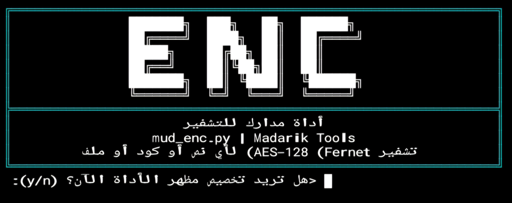
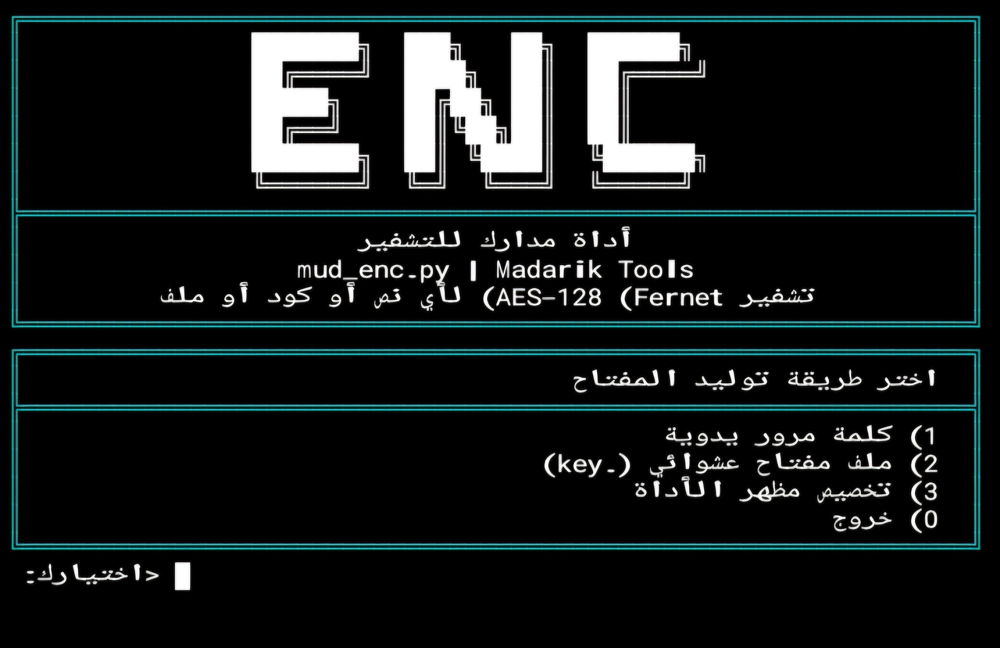

<div align="center">

# 🔐 mud-enc | أداة مدارك للتشفير

</div>

**أداة سطر أوامر عربية لتشفير وفك تشفير النصوص والأكواد والملفات — بواجهة RTL كاملة**

Arabic-first CLI encryption tool for text, code, and any file type — powered by Fernet (AES-128 + HMAC-SHA256)

<div align="center">
  
[](LICENSE)<br>
<br>
[](https://github.com/mmuhacker)<br>
<br>
<br>
<br>
<br>
<br>
[](https://github.com/mmuhacker)

</div>

---

📚 **المحتويات**
- [نبذة عن الأداة](#نبذة)
- [مميزات الأداة](#مميزات)
- [لقطات الأداة](#لقطات)
- **التثبيت**
  - [على Termux 📲](#تيرمكس)
  - [على توزيعات لينكس🐧](#لينكس)
- [⁉️ المشاكل وحلولها](#error)
- [🚀 الإستخدام](#إستخدام)
- [💡 أمثلة عملية](#أمثلة)
- [🔒 كيف يعمل التشفير](#كيف)
- [📝 ملف requirements.txt](#txt)
- [🤝 المساهمة](#مساهم)
- [👨‍💻 المطور](#المطور)
- [📜 الرخصة License](#رخصة)

---

<div align="center" id="نبذة">
  
## 📖 نبذة عن الأداة
</div>

هي جزء من سلسلة **Madarik Tools (مدارك)** — أداة تشفير عامة تعمل من الطرفية (Terminal)،

---

<div align="center" id="مميزات">
  
## 🎯 مميزات الأداة
  
</div>

- تخصيص واجهة الأداة عند تشغيلها، تستطيع تخصيص ألوان **البانر** و**الخطوط** واختيار **لون للخلفية** والتحكم بها من داخل الأداة.
- تشفير وفك تشفير أي **نص أو كود برمجي** يُلصق مباشرة
- تشفير وفك تشفير **أي نوع ملف** (نصوص، صور، APK، أرشيفات، إلخ) دون أي فقدان أو تلف بالبيانات
- **كشف تلقائي**: تلصق نص، والأداة تعرف وحدها إذا كان يحتاج تشفيراً أو فك تشفير
- وضعان لتوليد المفتاح: **كلمة مرور** (PBKDF2 + Salt عشوائي) أو **ملف مفتاح** (`.key`) عشوائي
- تشفير معياري بـ **Fernet (AES-128-CBC + HMAC-SHA256)** من مكتبة `cryptography`
- واجهة عربية **RTL كاملة** مع صناديق وحدود قابلة للتخصيص
- يعمل على **Termux (أندرويد)** و **توزيعات لينكس** دون أي تعديل

---

<div align="center" id="لقطات">

## 🖼️ لقطات من الأداة
</div>

<p align="center">
  <br>
  <em>الشكل 1: واجهة البانر الرئيسية</em>
</p>
<p align="center">
  <br>
  <em>الشكل 2: القائمة الرئيسية للأداة</em>
</p>

---

## ⚙️ التثبيت

<div align="center" id="تيرمكس">

## على Termux (أندرويد)

</div>

- **الخطوة الأولى:** تحديث النظام والمكتبات

```bash
pkg update && pkg install python -y
```

- **الخطوة الثانية:** تثبيت python-cryptography

```bash
pkg install python-cryptography -y
```

⚠️ **ملاحظة:** على Termux، يتم تثبيت cryptography عبر pkg لتجنب مشاكل التوافق مع ABI، بينما على لينكس يمكن تثبيتها مباشرة عبر pip.

- **الخطوة الثالثة:** تثبيت المكتبات المطلوبة لعرض النص العربي بالشكل الصحيح

```bash
pip install arabic_reshaper python-bidi==0.4.2
```

- **الخطوة الرابعة:** تثبيت الخط العربي (للعرض الصحيح)

```bash
curl -L "https://fonts.gstatic.com/s/notonaskharabic/v33/RrQ5bpV-9Dd1b1OAGA6M9PkyDuVBePeKNaxcsss0Y7bwvc-VaA.ttf" -o ~/.termux/font.ttf
termux-reload-settings
```

⚠️ هام: أغلق Termux تماماً من قائمة التطبيقات الخلفية وافتحه من جديد

- **الخطوة الخامسة:** تثبيت الأداة

```bash
curl -L -o ~/mud_enc.py https://raw.githubusercontent.com/mmuhacker/mud-enc/main/mud_enc.py
```

- **الخطوة السادسة:** إعطاء صلاحية التنفيذ

```bash
chmod +x ~/mud_enc.py
```

- **الخطوة السابعة:** إنشاء اختصار التشغيل

```bash
ln -sf ~/mud_enc.py $PREFIX/bin/enc
```

- **أو قم بكل شيء بالأمر المُجَمَّع:**

```bash
pkg update && \
pkg install python -y && \
pkg install python-cryptography -y && \
pip install arabic_reshaper python-bidi==0.4.2 && \
curl -L "https://fonts.gstatic.com/s/notonaskharabic/v33/RrQ5bpV-9Dd1b1OAGA6M9PkyDuVBePeKNaxcsss0Y7bwvc-VaA.ttf" -o ~/.termux/font.ttf && \
termux-reload-settings && \
curl -L -o ~/mud_enc.py https://raw.githubusercontent.com/mmuhacker/mud-enc/main/mud_enc.py && \
chmod +x ~/mud_enc.py && \
ln -sf ~/mud_enc.py $PREFIX/bin/enc
```

- **بعدها شغّل الأداة من أي مكان بالأمر:**

```bash
enc
```

---

<div align="center" id="لينكس">

## على توزيعات لينكس 🐧

</div>

- **الخطوة الأولى:** تحديث النظام

```bash
sudo apt update && sudo apt upgrade -y
```

- **الخطوة الثانية:** تثبيت بايثون إذا لم تكن مثبتة

```bash
sudo apt install python3 python3-pip -y
```

- **الخطوة الثالثة:** تثبيت cryptography والمكتبات

```bash
pip install cryptography arabic_reshaper python-bidi==0.4.2 --break-system-packages
```

- **الخطوة الرابعة:** تثبيت الخط العربي وتفعيله في الذاكرة المؤقتة

```bash
sudo apt install xfonts-utils -y && \
sudo mkdir -p /usr/share/fonts/truetype/noto && \
sudo curl -L "https://raw.githubusercontent.com/googlefonts/noto-fonts/main/hinted/ttf/NotoNaskhArabic/NotoNaskhArabic-Regular.ttf" -o /usr/share/fonts/truetype/noto/NotoNaskhArabic-Regular.ttf && \
sudo fc-cache -fv
```

- **الخطوة الخامسة:** تثبيت الأداة وإعطاء صلاحية التنفيذ

```bash
curl -L -o ~/mud_enc.py https://raw.githubusercontent.com/mmuhacker/mud-enc/main/mud_enc.py && \
chmod +x ~/mud_enc.py
```

- **الخطوة السادسة:** إنشاء الاختصار enc

```bash
sudo ln -sf ~/mud_enc.py /usr/local/bin/enc
```

- **أو قم بعمل كل شيء بالأمر المُجَمَّع:**

```bash
sudo apt update && \
pip install --upgrade pip && \
pip install --user cryptography arabic_reshaper python-bidi==0.4.2 && \
sudo apt install xfonts-utils -y && \
sudo mkdir -p /usr/share/fonts/truetype/noto && \
sudo curl -L "https://raw.githubusercontent.com/googlefonts/noto-fonts/main/hinted/ttf/NotoNaskhArabic/NotoNaskhArabic-Regular.ttf" -o /usr/share/fonts/truetype/noto/NotoNaskhArabic-Regular.ttf && \
sudo fc-cache -fv && \
curl -L -o ~/mud_enc.py https://raw.githubusercontent.com/mmuhacker/mud-enc/main/mud_enc.py && \
chmod +x ~/mud_enc.py && \
sudo ln -sf ~/mud_enc.py /usr/local/bin/enc
```

- **شغّل الأداة**
```bash
enc
```

---

<div align="center" id="error">

## ⁉️ المشاكل وحلولها

</div>

قد تواجه بعض المشكلات في عمل الأداة وهذه طرق إصلاحها

إذا واجهت مشكلة باستيراد cryptography على Termux (خطأ dlopen / ABI)، ثبّتها عن طريق pkg install python-cryptography بدل pip — نسخة pkg مبنية خصيصاً لبيئة Termux.

---

<div align="center" id="استخدام">

## 🚀 الاستخدام

</div>

عند التشغيل، تطلب منك الأداة:
١. تخصيص المظهر (اختياري) — لون الإطار، لون خلفيته، لون النص.
٢. طريقة توليد المفتاح — كلمة مرور، أو ملف مفتاح .key (توليد جديد أو تحميل موجود)
٣. من القائمة الرئيسية تختار:
   - تشفير / فك تشفير نص — تلصق النص مباشرة، والأداة تكتشف تلقائياً إذا كان يحتاج تشفيراً أو فك تشفير
   - تشفير ملف — تعطيها مسار أي ملف، وستعطيك نسخة مشفرة بامتداد .mud
   - فك تشفير ملف — تعطيها ملف .mud، وستعيد الملف الأصلي كما هو تماماً

بعد كل عملية، تستطيع أن تحفظ النتيجة أو تنسخ الملف الناتج مباشرة لمجلد التنزيلات (يتم اكتشافه تلقائياً حسب المنصة).
---

<div align="center" id="أمثلة">
  
## 💡 أمثلة عملية

</div>

تشفير ملف نصي:


enc
١. اختر "تشفير ملف"
٢. أدخل المسار: /home/user/document.txt
٣. سيتم إنشاء: document.txt.mud

فك تشفير ملف:


enc
١. اختر "فك تشفير ملف"
٢. أدخل المسار: /home/user/document.txt.mud
٣. سيتم استعادة الملف الأصلي

---

<div align="center" id="كيف">

## 🔒 كيف يعمل التشفير

</div>

· وضع كلمة المرور: يُشتق مفتاح 256-بت عبر PBKDF2HMAC-SHA256 بـ 200,000 تكرار و Salt عشوائي مختلف بكل عملية — نفس كلمة المرور تعيد نفس الملف الأصلي بالضبط.
· وضع ملف المفتاح: مفتاح Fernet عشوائي بالكامل (Fernet.generate_key()) يُحفظ بملف .key منفصل — أقوى من كلمة المرور، لكن يجب أن تحافظ على الملف نفسه.
· الملفات تُقرأ وتُكتب بصيغة ثنائية (rb/wb) فتشتغل بشكل صحيح مع أي نوع ملف دون أي تلف بالبيانات.
· لا توجد طريقة لاسترجاع البيانات إذا فقدت كلمة المرور أو ملف المفتاح — هذا تصميم مقصود لضمان الأمان الحقيقي.

---

<div align="center" id="txt">

## 📝 ملف requirements.txt

</div>

```
cryptography>=3.4.8,<4.0.0
arabic-reshaper>=3.0.0
python-bidi>=0.4.2
```
---

<div align="center" id="تحديث">

## 🔄 تحديث الأداة

</div>

لتحديث الأداة إلى أحدث إصدار:

```bash
curl -L -o ~/mud_enc.py https://raw.githubusercontent.com/mmuhacker/mud-enc/main/mud_enc.py
chmod +x ~/mud_enc.py
```

---

<div align="center" id="مساهم">

## 🤝 المساهمة

</div>

المساهمات مرحب بها! يمكنك:

- فتح Issue للإبلاغ عن خطأ
- تقديم Pull Request لإضافة ميزة
- اقتراح تحسينات عبر Issues

معايير المساهمة

- تأكد من أن الكود يعمل على كل من Termux ولينكس
- اتبع أسلوب Python (PEP 8)
- حدّث ملف README.md إذا أضفت ميزة جديدة
- اختبر التغييرات قبل تقديم Pull Request

---

<div align="center" id="المطور">

## 👨‍💻 المطور

**Muhannad Daher**

[](https://github.com/mmuhacker)

</div>

---

<div align="center" id="رخصة">

## 📜 الرخصة

</div>

هذا المشروع مرخّص بموجب رخصة مدارك تولز — النسخ والتوزيع بدون تعديل مع ذكر المصدر.

بالمختصر:

· ✅ مسموح: نسخ الأداة كاملة غير معدلة، واستخدامها، وإعادة توزيعها، مع ذكر المصدر ورابط المستودع
· ❌ ممنوع: تعديل الكود أو توزيع نسخة معدّلة منه، أو ادعاء ملكيته

راجع ملف LICENSE للنص الكامل.

---

<div align="center">

صُنعت بـ 🖤 كجزء من Madarik Tools

</div>

---
